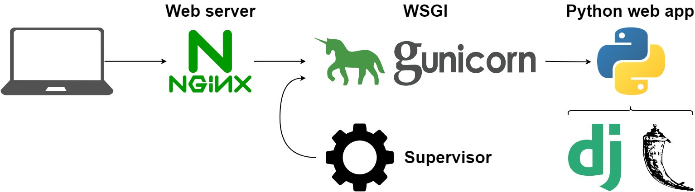

# Gunicorn

Gunicorn é um servidor web Python HTTP que funciona como um gateway entre uma aplicação web Python e a internet. O nome Gunicorn vem de "Green Unicorn", que faz referência ao fato de que o servidor é capaz de lidar com múltiplas conexões simultâneas (de forma "verde" ou "eficiente").

Gunicorn é usado para servir aplicativos Python que usam a especificação WSGI (Web Server Gateway Interface). WSGI é uma interface padrão de comunicação entre um servidor web e uma aplicação web Python. A especificação WSGI permite que diferentes servidores web, como o Gunicorn, Apache ou Nginx, comuniquem-se com aplicativos web Python de maneira consistente.

Ao usar o Gunicorn para hospedar um aplicativo Python, você pode se beneficiar de sua capacidade de lidar com várias solicitações de usuários simultâneas, tornando a aplicação escalável e eficiente. Além disso, o Gunicorn possui recursos de processamento de solicitações em paralelo, o que permite que o servidor processe várias solicitações simultaneamente sem bloquear o processamento de outras solicitações.

Resumindo, o Gunicorn é um servidor web Python HTTP usado para hospedar aplicativos web Python que usam a especificação WSGI. É uma ferramenta importante para tornar aplicativos web escaláveis, eficientes e capazes de lidar com várias solicitações simultâneas.

## Gunicorn + Nginx

O Gunicorn e o Nginx são frequentemente usados juntos para hospedar aplicativos web Python de maneira eficiente e escalável.

O Gunicorn é responsável por gerenciar a execução da aplicação Python, enquanto o Nginx atua como um proxy reverso para o Gunicorn. O Nginx recebe as solicitações HTTP do cliente e, em seguida, encaminha essas solicitações para o Gunicorn, que processa as solicitações e retorna as respostas para o Nginx, que as envia de volta para o cliente.

A utilização do Nginx como proxy reverso para o Gunicorn oferece uma série de vantagens, como:

Balanceamento de carga: o Nginx pode ser configurado para distribuir as solicitações de entrada entre vários servidores Gunicorn, ajudando a distribuir a carga de trabalho e garantir que cada servidor seja utilizado de forma eficiente.

Cache: o Nginx pode ser configurado para armazenar em cache as respostas dos servidores Gunicorn, melhorando o desempenho e reduzindo a latência para os clientes que acessam o aplicativo com frequência.

Segurança: o Nginx pode ser usado para proteger o servidor Gunicorn de ataques maliciosos, filtrando o tráfego malicioso e limitando o acesso a recursos importantes do servidor.

Resumindo, o Nginx e o Gunicorn trabalham juntos para fornecer uma plataforma escalável e eficiente para hospedar aplicativos web Python. O Nginx atua como um proxy reverso para o Gunicorn, lidando com balanceamento de carga, cache e segurança, enquanto o Gunicorn é responsável pela execução da aplicação Python.

